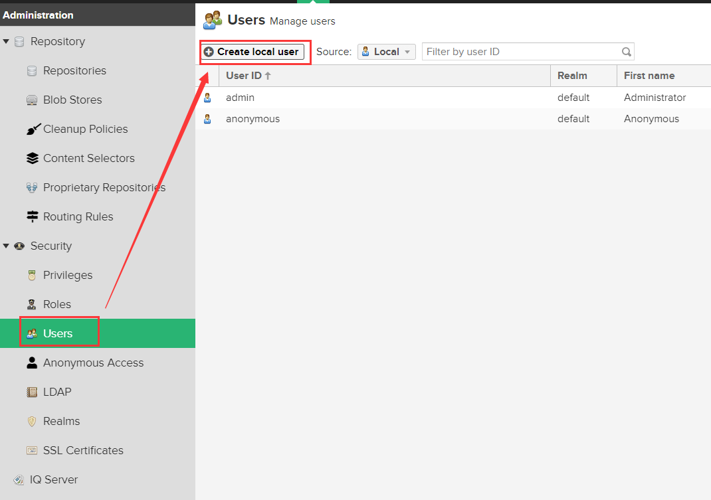

nexus搭建npm私服
======================
#### 第一步，下载nexus
下载地址：https://help.sonatype.com/repomanager3/download?utm_campaign=2019%20Repo%20OSS&utm_medium=email&_hsmi=102690947&_hsenc=p2ANqtz-_eZizUu2pvgqQ-hSgmv9YB6pMFlWq4Uo2_VbG6Xmn2jAMkZjHxeKcPMKhi7IQEcuaDG_VVlwzz7m-dF7Kr6cy_yaxQxw&utm_content=102690947&utm_source=hs_automation

#### 第二步，解压、运行
下载的版本nexus 3.30.1-01  
  
解压缩后，进入nexus-3.30.1-01\bin  
cmd命令行执行：nexus.exe /run

启动后，访问地址：<u>http://localhost:8081/</u>  
默认用户名：admin  
3.17版后密码在<u> \nexus-3.30.1-01-win64\sonatype-work\nexus3\admin.password </u>里

#### 第三步，创建存储空间
  
  

#### 第四步，创建仓库
  
  
     
    - hosted（私有仓库）：用于发布个人开发的npm包
    - proxy（代理仓库）：代理npm或淘宝镜像等
    - group（组合仓库）：对外公开的仓库，集合了hosted和proxy
    
1. 创建 Hosted npm Registries
  
输入仓库名称，存储空间选择刚刚创建的，也可以用默认的。点击create创建。

2. 创建 Proxy npm Registries
  
输入仓库名称，选择存储空间，代理的远程地址可以写https://registry.npmjs.org，也可以写淘宝镜像。点击create创建。

1. 创建 Group npm Registries
  
组合仓库中除了输入名称和选择存储空间之外，还要选择要包括的仓库，越靠上优先级越高，如果私有仓库在上，用户下载npm包的时候会优先下载私有仓库中的，如果私有仓库没有再去代理仓库中下载。

#### 第五步，创建用户，设置权限（用于发布npm包）
  
然后是设置权限，这一步如果不设置，是不能发布自己的npm包的。  
  

#### 第六步，用户端使用私服
到这里，nexus的设置都好了，下面何使用私服下载npm和上传npm
1. 用户端设置npm的registry为group仓库  
   首先复制出group仓库的链接地址    
     
然后，用户端设置registry。

方法一：
命令行执行：
```
npm config set registry http://npm私服所在服务器的ip地址:8081/repository/npm-group/
```

2. 用户端发布自己的npm包到私服（执行的命令均在发布的模块根目录下）  
首先，登陆私服
```
npm login –registry=http://npm私服所在服务器的ip地址:8081/repository/npm-hosted/
```
这时候需要输入nexus的用户名、密码和邮箱。  
然后，就可以发布了，要发布的模块，必须保证在根目录下有package.json文件，否则会报错。

命令行执行：
```
npm publish –registry=http://npm私服所在服务器的ip地址:8081/repository/npm-hosted/
```
到此，可以到nexus验证一下有没有发布成功  
  